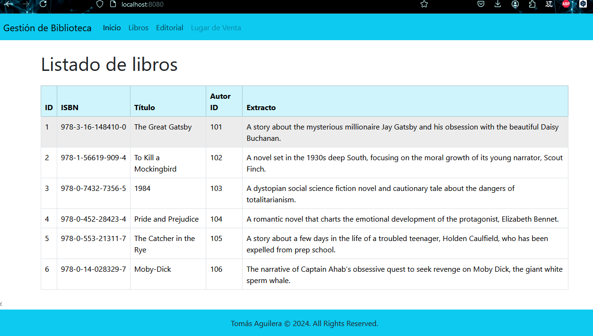

Desafío - Sistema de Gestión de Biblioteca (I)
--

En este desafío validaremos nuestros conocimientos de creación de proyectos web Spring
Boot. Para lograrlo, necesitarás aplicar previamente todo el material disponible en la unidad
correspondiente.

Lee todo el documento antes de comenzar el desarrollo individual, para asegurarte de tener el
máximo de puntaje y enfocar bien los esfuerzos. Una vez terminado el desafío, comprime la
carpeta que contiene el desarrollo de los requerimientos solicitados y sube el .zip en el LMS.

Descripción
--
Proyecto Sistema de Gestión de Biblioteca.
Debido a la creciente demanda de una solución tecnológica eficaz para bibliotecas, se ha
solicitado el desarrollo de un sistema de gestión de biblioteca avanzado. La empresa de
software ha sido nuevamente contratada para actualizar y mejorar el software existente, con el
objetivo de implementarlo en bibliotecas de todo el país.

Dado esto, se está solicitando implementar las inyecciones de dependencias como método
para saber el historial de acciones que realiza el software en un puesto de trabajo.
De acuerdo a este contexto, deberás de mostrar un aplicativo web Spring Boot donde en el log
de la consola nos muestre el estado del proceso. El plus más importante de este aplicativo es
saber mostrar los conocimientos previos sobre el uso de las anotaciones, y la inyección de
dependencias bajo la arquitectura de Spring.

Para este desafío el enfoque estará en la configuración del proyecto, la inyección de
dependencias y la implementación de un sistema de bitácora para registrar las acciones del
usuario.

Requerimientos
--
Mediante la utilización del IDE de desarrollo Eclipse, se debe crear un nuevo proyecto Web
Spring Boot llamado “GestorBiblioteca”.
Una vez creado el proyecto, se debe crear la inyección de dependencias, la cual será reflejada
en el log de la consola, en donde se debe retornar un mensaje de bitácora de cada acción que
realiza el usuario final.
1. Crear un nuevo proyecto Web Spring Boot llamado “GestorBiblioteca”que contenga la
   estructura de un proyecto Spring y las dependencias necesarias en el pom.xml. (2.5
   Puntos)
2. Implementar las buenas prácticas del uso de las Anotaciones. (2.5 Puntos)
3. Retornar en consola a través del uso del logger, mensaje que realiza el usuario. (2.5
   Puntos)
4. Implementar las buenas prácticas del uso de la inyección de dependencias. (2.5 Puntos)
   ¡Mucho éxito!
   Consideraciones y recomendaciones
1. Se puede apoyar de los ejercicios vistos en unidades anteriores a modo de consulta.
2. Debes recordar el uso de anotaciones, y la inyección de dependencias.

   ¡Vamos con todo!
   

Imagen del Proyecto Realizado

